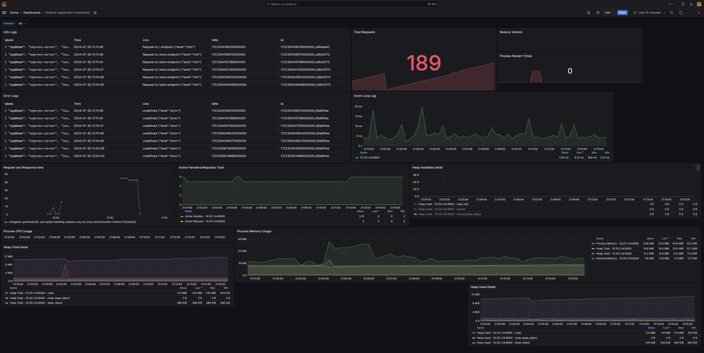

# Monitoring with Grafana, Loki, and Prometheus

This guide provides a step-by-step process for setting up monitoring and logging for a Node.js application using Grafana, Loki, and Prometheus. The tutorial includes instructions for setting up Prometheus to collect metrics, Grafana to visualize data, and Loki for logging.

## Tech Stack


## Installation and Setup

### 1. Prometheus Server

#### Create Prometheus Configuration

Create a `prometheus-config.yml` file and copy the following configuration. Replace `<NODEJS_SERVER_ADDRESS>` with the actual address of your Node.js server.

```yaml
global:
  scrape_interval: 4s

scrape_configs:
  - job_name: prometheus
    static_configs:
      - targets: ["<NODEJS_SERVER_ADDRESS>"]
```

#### Start Prometheus Server

Use Docker Compose to start the Prometheus server:

```yaml
version: "3"

services:
  prom-server:
    image: prom/prometheus
    ports:
      - 9090:9090
    volumes:
      - ./prometheus-config.yml:/etc/prometheus/prometheus.yml
```

Run the following command to start Prometheus:

```bash
docker-compose up -d
```

Prometheus will now be running at `http://localhost:9090`.

### 2. Setup Grafana

Run the following command to start Grafana:

```bash
docker run -d -p 3000:3000 --name=grafanaserver grafana/grafana-oss
```

Grafana will be accessible at `http://localhost:3000`.

### 3. Setup Loki Server

Run the following command to start Loki:

```bash
docker run -d --name=loki -p 3100:3100 grafana/loki
```

Loki will be running at `http://localhost:3100`.

### 4. Setup Node.js Application

#### Dependencies

Install the required dependencies:

```bash
npm install express response-time prom-client winston winston-loki
```


### 5. Adding Prometheus Data Source to Grafana

1. Open Grafana at `http://localhost:3000` and log in (default credentials are `admin/admin`).
2. Navigate to Configuration > Data Sources.
3. Click on "Add data source" and select "Prometheus".
4. Configure the Prometheus URL (e.g., `http://localhost:9090`) and save.

### 6. Adding Loki Data Source to Grafana

1. Open Grafana and navigate to Configuration > Data Sources.
2. Click on "Add data source" and select "Loki".
3. Configure the Loki URL (e.g., `http://localhost:3100`) and save.

### 7. Importing Node.js Application Dashboard

1. In Grafana, navigate to Dashboards > Manage.
2. Click on "Import" and enter the dashboard ID or upload a JSON file for the Node.js Application Dashboard.
3. Configure the data sources for Prometheus and Loki.

### Demo

You should now see the Node.js application metrics and logs in Grafana. The dashboard will display information such as request and response times, CPU usage, memory usage, heap details, and custom metrics like Total no of requests and more...



